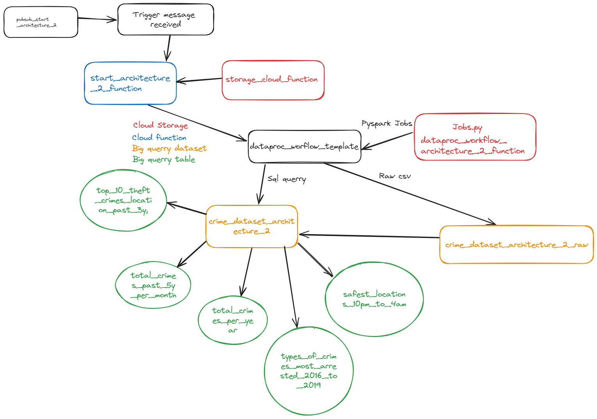
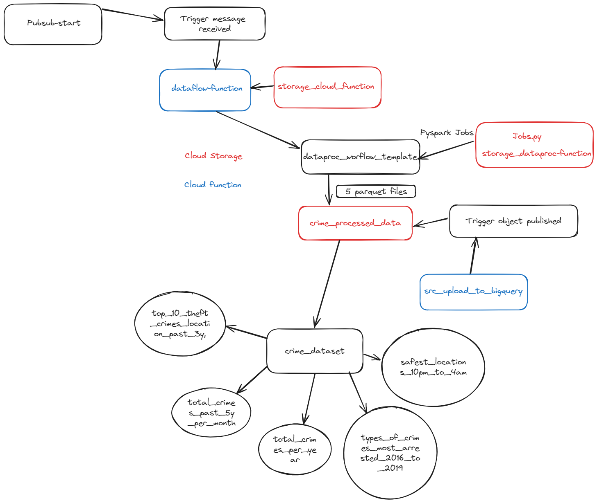

# PROJECT NODALE ETL FLOW

## Architecture 1

> [!IMPORTANT]
> Lancer Architecture 1: 
> Pour lancez le projet, il faut aller dans Pub/Sub et envoyer un message a **pubsub-start**

Une cloud function va se lancer et instancier un dataproc workflow template avec un job Pyspark.
Ce job va traiter les données avec pyspark et les envoyer dans un cloud storage sous la forme de cinq fichiers parquets.

Une cloud function avec un event sur le cloud storage (si un objet est écrit ou réécrit) va se lancer et envoyer les données dans Bigquery
Comme c'est une cloud function, elle va prendre un certains temps a se lancer et a s'arrêter, il faut donc attendre un peu avant de voir les données dans Bigquery.
Chaque fichier parquet va être envoyer dans une table bigquery différente sous **crime_dataset**

> [!NOTE]
> Résultat architecture 1: 5 tables vont être écrit sous crime crime_dataset 

## Architecture 2

> [!IMPORTANT]
> Lancer architecture 2 :
> Pour lancez le projet, il faut aller dans Pub/Sub et envoyer un message a pubsub-start-architecture2

Pour lancez le projet, il faut aller dans Pub/Sub et envoyer un message a pubsub-start-architecture2

Une cloud function va se lancer et instancier un dataproc workflow template avec un job pyspark
Il va envoyer la donnée dans bigquery directement sous format raw sous crime_dataset_architecture_2_raw
Ensuite plusieurs querry vont etre run pour traiter les données en utilisant la library google cloud bigquery 
Les querry vont créé une table différente pour chaque querry sous crime_dataset_architecture_2 elle utilise crime_dataset_architecture_2_raw.crime_data comme table source 

> [!NOTE]
> Résultat architecture 1: 
> 5 tables vont être écrit sous crime crime_dataset_architecture_2

LLes architecturese ont été entièrement réalisées avec terraform et sont donc entièrement réutilisables et modifiable 5 modules terraform sont d'ailleurs réutilisés dans les deux projets 

- big_dataset_table
- cloud_function
- cloud_storage
- dataproc_workflow_template
- pub_sub

